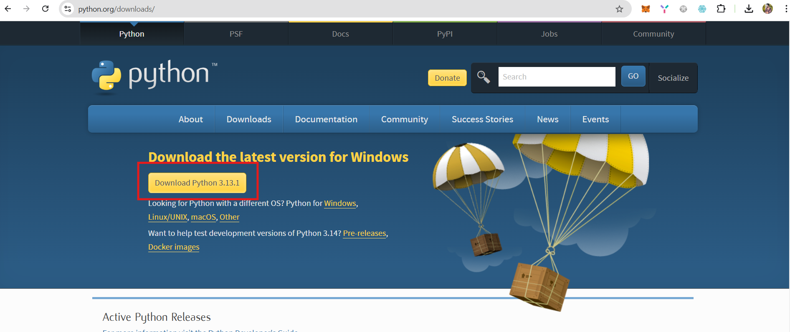
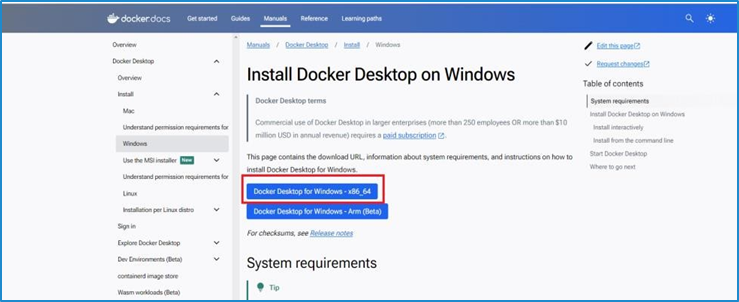

 # Instructions For Running Python Flask App
 ## Prerequisites
    - Python 3.10+ 
    - Docker

## Python Installation
1. Go to offical Python Site and install Python : **[Python Link](https://www.python.org/downloads/)**  <br> <br>


## Docker Setup
### Docker Installation:
1.	Download the Docker - **[Docker install](https://docs.docker.com/desktop/install/windows-install/)**
\
    
2.	Select the ***Docker Desktop for Window – x86_64*** version.
3.	Once the file downloaded, please install that file ***Run as Administrator*** 
4.	Enable the Checkboxes and then Click on OK  
\
    
5.	After that the below files loading screen will display  
\
    
6.	After Installation completed. Click on Close and Restart option. The System will restart automatically.  
Note: If system was not automatically restarted. Then restart manually  
\
    
7.	After the system was restarted. The Docker Service Agreement will be populated automatically. Click on Accept  
\


## Run with Docker:
1.	Open python code in Visual Studio Code.
2.	Open new terminal.
3.  Enter command
```
 docker compose up --build
```

  <br>
4. It will take some time to install all dependencies and then this kind of message is displayed. <br>
\
  
5.	Docker Container is running on **http://127.0.0.1:5050** this server.  
6.	To see the container logs open Docker Desktop app.  
7.	Click on Containers. <br> <br>
  
8.	Open dod_chatbot and see the logs. <br> <br>
 <br> <br>
Now Python app is running successfully. <br>
Connect with frontend to test this. <br> <br>
9.	To Stop the docker container Press **Ctrl + c** in vs code terminal. <br> <br>


## Run Without Docker
**1. Create Virtual Environment Go to the New Terminal**
```
    python -m venv venv
```
**2. Activate Virtual Environment**
```
    venv\scripts\activate
```
**3. Install all dependencies**
```
    pip install -r requirements.txt
```
**4. Run Python app**
```
    python app.py
```